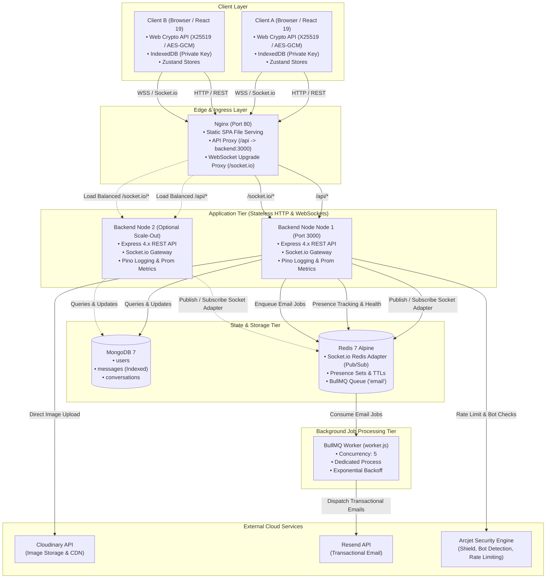
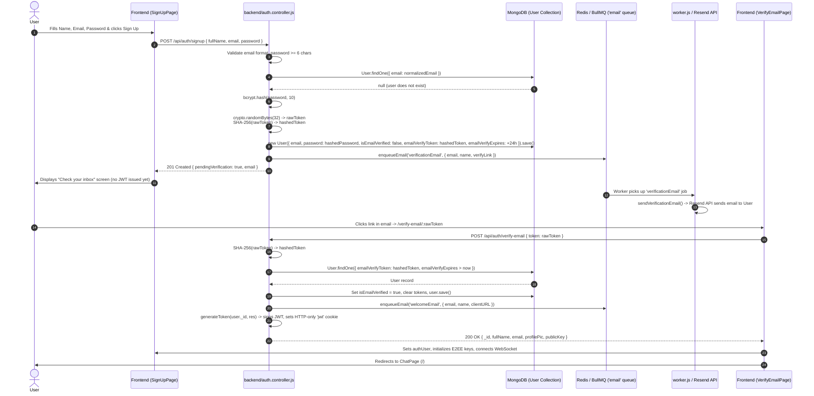
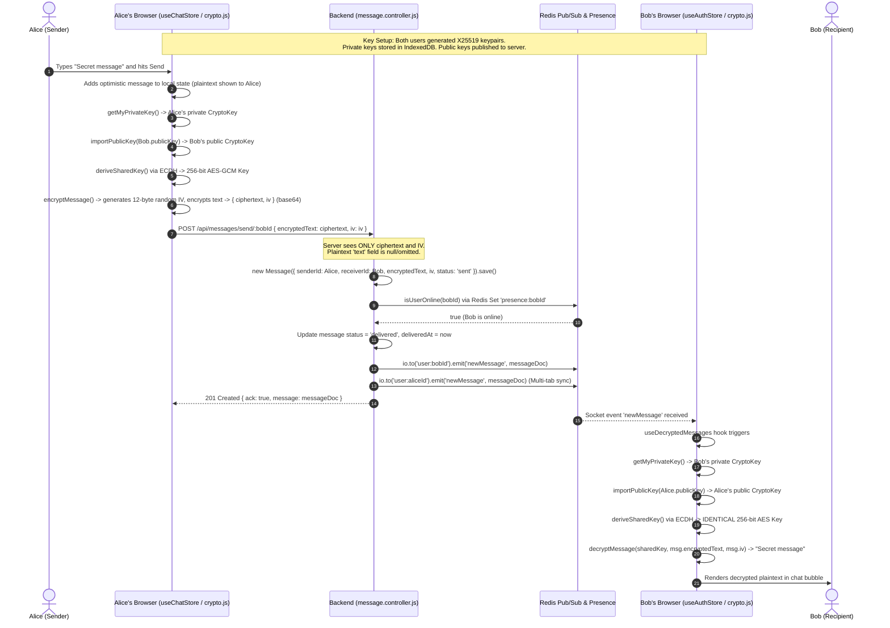
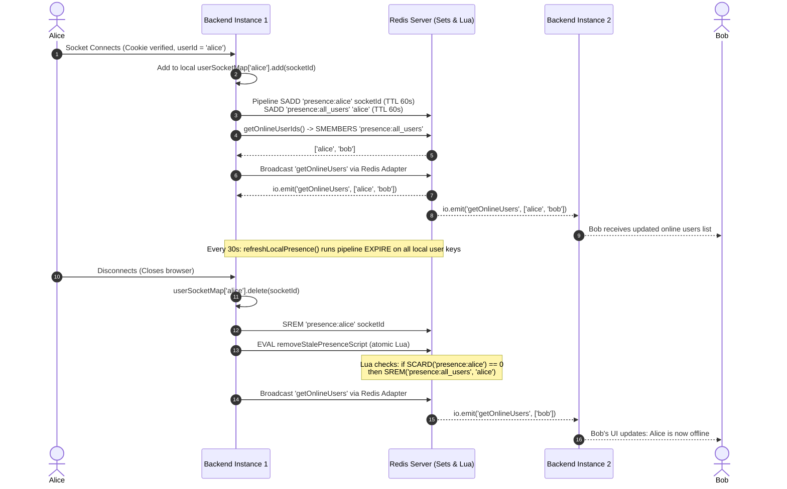
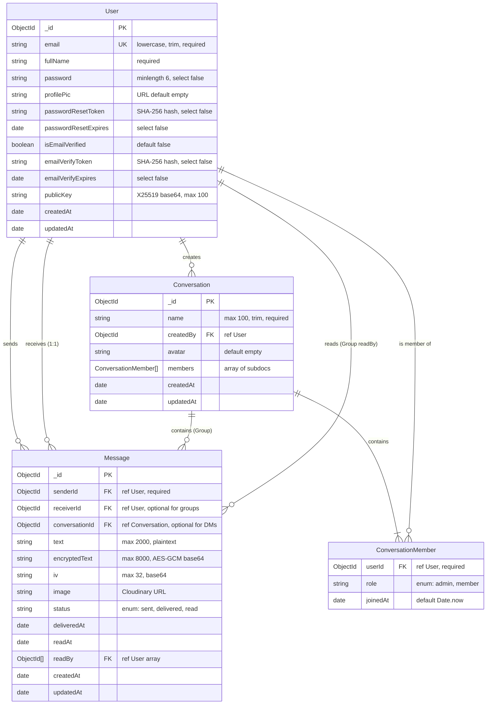

# Project Guide & Technical Walkthrough: Messenger Real-Time Platform

> **Document Context & Relationship**:
> - [`README.MD`](../README.MD) serves as the project pitch, high-level feature summary, and quick-start guide.
> - [`PROJECT_REPORT.md`](../PROJECT_REPORT.md) is a contributor quick-reference and architectural summary.
> - **This document (`docs/PROJECT_GUIDE.md`) is the complete technical walkthrough.** It is designed for engineers, engineering managers, and technical reviewers who need to deeply understand the system's inner mechanics, security guarantees, data flows, failure domains, and code layout without having to inspect every source file first.

---

## 1. What This Is and Who It's For

### 1.1 Product Overview
**Messenger** is a full-stack, real-time communications application supporting:
- Authenticated user accounts with mandatory transactional email verification and self-service password reset flows.
- 1:1 Direct Messaging (DM) with cryptographic End-to-End Encryption (E2EE) for text messages.
- Persistent Multi-User Group Chats with role management (admin/member), dynamic member leave handling, and senior-member admin auto-promotion.
- Real-time chat features: live typing indicators, delivery acknowledgments, read receipts, and cross-instance user presence (online/offline tracking).
- Rich image media attachments uploaded directly to Cloudinary.
- Responsive browser interface built with React 19, Tailwind CSS, and custom tactile audio feedback.

### 1.2 Who It's For & Technical Interest
This project is engineered as an evaluation platform demonstrating how a modern real-time messaging system transitions from a single-server prototype to a resilient, production-grade architecture. Rather than treating real-time chat as a simple toy WebSocket server, the codebase directly tackles hard distributed systems and security challenges:

1. **Horizontal Scalability via Redis**:
   - WebSockets are stateful, single-instance connections by default. This application integrates `@socket.io/redis-adapter`, allowing multiple backend application nodes to sit behind a reverse proxy while seamlessly broadcasting messages and events across cluster instances via Redis pub/sub.
   - User presence is decoupled from Node process memory into atomic Redis Sets with rolling TTL expiration and Lua script cleanup, guaranteeing consistent presence states across multiple server replicas while maintaining a zero-dependency in-memory fallback for single-node development.
2. **True Zero-Knowledge End-to-End Encryption (E2EE) for Direct Messages**:
   - Implemented via the native browser Web Crypto API using X25519 Elliptic Curve Diffie-Hellman (ECDH) key agreement and 256-bit AES-GCM symmetric authenticated encryption with unique per-message Initialization Vectors (IVs).
   - The server only ever acts as an encrypted ciphertext relay. Private keys never leave the client's device (held in browser IndexedDB as non-extractable CryptoKey handles).
3. **Asynchronous Background Job Processing**:
   - Email dispatch (welcome emails, verification tokens, password reset links via Resend) is removed from the HTTP request-response cycle and offloaded to a Redis-backed BullMQ queue processed by an isolated worker process with automated exponential backoff and retry policies.
4. **Defense-in-Depth & Observability**:
   - Integrated with Arcjet security middleware (bot detection, spoofed agent mitigation, IP sliding-window rate limiting).
   - Prometheus metrics exposition (`/metrics`) instrumenting HTTP traffic and WebSocket connections alongside deep health checking (`/api/health`) verifying MongoDB and Redis connectivity.

---

## 2. System Architecture

### 2.1 System Architecture Diagram



### 2.2 Component Breakdown & Failure Impact Analysis

| Component | Responsibility | Failure Impact If Removed / Unavailable |
|---|---|---|
| **Frontend (React 19 / Vite / Nginx)** | User interface, local state (Zustand), Web Crypto ECDH key derivation, client-side encryption/decryption, IndexedDB key management. | Complete loss of UI. Direct access to REST API would still be possible via curl/Postman, but E2EE direct messages could not be decrypted without client-side private keys. |
| **Backend API (Node / Express / Socket.io)** | REST endpoints for auth, message pagination, group operations, Socket connection lifecycle, token generation/verification, Prometheus metrics. | Complete failure of application logic, authentication, and live message dispatch. |
| **Socket.io Layer** | WebSocket connection multiplexing, room-based broadcasting (`user:${id}`, `group:${id}`), real-time delivery ack, typing signals, presence broadcast. | Users would be forced to poll REST endpoints. Real-time typing indicators, read receipts, and live incoming message push would cease to function. |
| **MongoDB (v7)** | System of record for `User`, `Message`, and `Conversation` models, compound indexes for message cursor pagination, read receipt tracking. | Complete crash of backend services; server cannot authenticate users, record messages, or retrieve history. |
| **Redis (v7 Alpine)** | (1) Socket.io Redis Adapter pub/sub across multi-instance nodes. (2) Atomic user presence tracking across instances via Redis Sets. (3) BullMQ queue backend. | **Degraded Mode**: If `REDIS_URL` is omitted, the app falls back to: single-instance in-memory presence (`userSocketMap`), local-only socket emission, and synchronous in-process email sending. Multi-node horizontal scaling is lost. If Redis is configured but crashes, queue enqueue fails over to direct send, and socket adapter emits warnings. |
| **BullMQ Worker (`worker.js`)** | Standalone worker process consuming the `'email'` queue with concurrency 5, retries, and exponential backoff. | Emails remain queued in Redis without being sent. If the worker process is omitted, the backend's enqueue fallback sends emails synchronously in-process, increasing HTTP latency and risking timeouts. |
| **Resend API** | External transactional email gateway sending welcome emails, email verification links, and password reset tokens. | Users cannot verify newly registered accounts, receive password reset links, or complete onboarding. |
| **Cloudinary** | Cloud-based media storage and CDN for user avatars and chat image attachments. | Profile picture uploads and image message sharing fail. Text-only communication remains operational. |
| **Arcjet** | Edge application security middleware enforcing shield protection, search engine whitelisted bot detection, and IP-based sliding window rate limits (100 req/60s). | Application is unprotected against automated credential stuffing, bot scraping, and API denial-of-service. Note: Arcjet is designed fail-open (`next()` on catch), preventing backend outages if Arcjet service fails. |

---

## 3. Repository Map

### 3.1 Backend Architecture (`backend/src/`)

The backend codebase follows a layered MVC-like structure where routes, business logic (controllers), persistence (models), validation middleware, and shared infrastructure (`lib/`) are cleanly segregated:

```text
backend/src/
├── controllers/
│   ├── auth.controller.js           # Signup, login, email verification, password reset, profile update, public key publishing
│   ├── conversation.controller.js   # Group creation, listing, group message history, group message sending, leaving/admin promotion
│   └── message.controller.js        # Contact list, chat partner aggregation, 1:1 message history, 1:1 message sending, read receipts
├── emails/
│   ├── emailHandlers.js             # Resend API wrappers for welcome, verification, and reset emails
│   └── emailTemplates.js            # Responsive HTML email string templates with CTA buttons
├── lib/
│   ├── arcjet.js                    # Arcjet SDK initialization (shield, bot detection, slidingWindow rate limiter)
│   ├── cloudinary.js                # Cloudinary v2 SDK configuration
│   ├── createApp.js                 # Express app assembly: Pino HTTP logging, metrics middleware, body/cookie parsers, health/metrics routes
│   ├── db.js                        # Mongoose connection setup
│   ├── env.js                       # Centralized, frozen environment variable map loaded via dotenv
│   ├── logger.js                    # Pino JSON logger with development pino-pretty transport
│   ├── metrics.js                   # Prometheus Registry and metric collectors (http_requests_total, duration, active sockets, messages sent)
│   ├── queue.js                     # BullMQ Queue ('email') setup, job processors, and fallback direct execution
│   ├── resend.js                    # Resend client instance and default sender identity
│   ├── socket.js                    # Socket.io server, Redis Adapter setup, Redis presence tracking with Lua scripts, socket event routing
│   └── utils.js                     # JWT signing and secure cookie generation
├── middleware/
│   ├── arcjet.middleware.js         # Evaluates Arcjet security decisions (blocks rate limits, bots, spoofed bots)
│   ├── auth.middleware.js           # Validates HTTP-only 'jwt' cookie, verifies signature, hydrates req.user
│   └── socket.auth.middleware.js    # Handshake auth middleware parsing cookie header, verifying JWT, attaching socket.user
├── models/
│   ├── Conversation.js              # Mongoose schema for group chats, members subdocument array with roles, timestamps
│   ├── Message.js                   # Mongoose schema for 1:1 and group messages, E2EE fields, delivery status, compound indexes
│   └── User.js                      # Mongoose schema for users, hashed password, verification/reset tokens, base64 X25519 public key
├── server.js                        # HTTP entrypoint: validates production environment, serves frontend build, starts listening on PORT
└── worker.js                        # BullMQ standalone worker entrypoint: connects to Redis, consumes 'email' queue with concurrency 5
```

#### Why Infrastructure Is Separated Into `lib/` Modules
1. **`lib/createApp.js` vs `server.js`**:
   - `createApp.js` wires Express middleware, Prometheus metrics, and route handlers to the HTTP server created in `lib/socket.js`.
   - `server.js` is solely responsible for verifying the environment, mounting the production static build, and invoking `server.listen()`.
   - *Why this matters*: Integration tests (`backend/tests/*.test.js`) import `app` directly from `lib/createApp.js` and use `supertest(app)` without binding to a physical TCP port, avoiding port collisions during CI.
2. **`lib/socket.js`**:
   - Isolates Socket.io configuration, Redis adapter initialization, cross-node presence logic, and socket room routing. Controllers import `io` and helper functions (`isUserOnline`) directly from `lib/socket.js`.
3. **`lib/queue.js`**:
   - Encapsulates BullMQ queue definitions, job name constants, job processing logic, and graceful in-process fallback. Both the main API (`enqueueEmail`) and the standalone worker (`worker.js`) share this single source of truth.

---

### 3.2 Frontend Architecture (`frontend/src/`)

The frontend is a single-page application built with React 19, Vite, and Zustand for state management. It enforces a strict separation between UI presentation, global reactive stores, and cryptographic utilities:

```text
frontend/src/
├── App.jsx                          # Route provider (React Router 7), authentication check on mount, global Toaster
├── main.jsx                         # React 19 createRoot DOM entry with StrictMode and BrowserRouter
├── index.css                        # Tailwind CSS directives, @property --border-angle, custom "Warm Room" color tokens
├── components/
│   ├── ActiveTabSwitch.jsx          # Tab switcher between 'chats' and 'contacts', plus 'New Group' modal trigger
│   ├── AuthBackground.jsx          # Presentational layout with ambient blurred glowing blobs for auth screens
│   ├── BorderAnimatedContainer.jsx  # Card framing wrapper with animated border styling for ChatPage
│   ├── ChatContainer.jsx            # Main chat pane: message bubble list, E2EE decryption hook, cursor pagination, image lightbox
│   ├── ChatHeader.jsx               # Active chat top bar: contact/group details, typing indicator text, online status, leave group button
│   ├── ChatsList.jsx                # Sidebar list merging 1:1 DMs and Groups, sorted by last message time, unread badges
│   ├── ContactList.jsx              # Searchable directory of all registered verified users
│   ├── CreateGroupModal.jsx         # Modal dialog with contact selection checklist to create a new group
│   ├── MessageInput.jsx             # Message composer: auto-growing textarea, typing debounce emitters, image picker/preview
│   ├── MessagesLoadingSkeleton.jsx  # Pulse animation placeholder while loading message history
│   ├── NoChatHistoryPlaceholder.jsx # Empty state for new conversation with interactive quick-reply suggestion chips
│   ├── NoChatsFound.jsx             # Empty state when user has no active chats, with button to switch to contacts tab
│   ├── NoConversationPlaceholder.jsx# Empty state when no conversation is selected on desktop
│   ├── PageLoader.jsx               # Full-page spinner during initial auth check
│   ├── ProfileHeader.jsx            # Top sidebar header: avatar upload, E2EE key status warning, audio toggle, logout
│   └── UsersLoadingSkeleton.jsx     # Pulse skeleton loader for contacts/chats sidebar
├── hooks/
│   └── useKeyboardSound.js          # Audio hook playing mechanical keyboard clicks on keydown (4 randomized audio samples)
├── lib/
│   ├── axios.js                     # Pre-configured Axios instance (baseURL: /api or localhost:3000/api, withCredentials: true)
│   ├── crypto.js                    # Web Crypto API wrapper: X25519 key generation, IndexedDB persistence, ECDH, AES-256-GCM
│   └── crypto.test.js               # Vitest unit test suite for cryptographic operations
├── pages/
│   ├── ChatPage.jsx                 # Primary authenticated application page (responsive 2-column layout)
│   ├── ForgotPasswordPage.jsx       # Password reset request form
│   ├── LoginPage.jsx                # Login form with specialized handling for EMAIL_UNVERIFIED code
│   ├── ResetPasswordPage.jsx        # Password reset confirmation form accepting URL token parameter
│   ├── SignUpPage.jsx               # Account registration form with "check your inbox" verification state
│   └── VerifyEmailPage.jsx          # Verification link landing page with automatic verification on mount
└── store/
    ├── useAuthStore.js              # Zustand store for auth user, login/signup/logout actions, socket connection, unread counts
    └── useChatStore.js              # Zustand store for contacts, chats, groups, active selection, messages, E2EE encrypt, typing state
```

---

## 4. Data Flow Walkthroughs

### 4.1 Signup Through Email Verification



#### Step-by-Step Path Across Files:
1. **Frontend Input**: User submits registration form on [`SignUpPage.jsx`](file:///home/sarthak-surale/Documents/Programming/Projects/chat-application/frontend/src/pages/SignUpPage.jsx). The action calls `signup(formData)` in [`useAuthStore.js`](file:///home/sarthak-surale/Documents/Programming/Projects/chat-application/frontend/src/store/useAuthStore.js).
2. **REST API**: Axios performs `POST /api/auth/signup`.
3. **Middleware**: [`arcjet.middleware.js`](file:///home/sarthak-surale/Documents/Programming/Projects/chat-application/backend/src/middleware/arcjet.middleware.js) evaluates the request against rate limits and bot policies.
4. **Controller Logic** ([`auth.controller.js:20`](file:///home/sarthak-surale/Documents/Programming/Projects/chat-application/backend/src/controllers/auth.controller.js#L20)):
   - Checks input presence and validates email regex `/^[^\s@]+@[^\s@]+\.[^\s@]+$/`.
   - Hashes password with `bcrypt.genSalt(10)` and `bcrypt.hash()`.
   - Generates a 32-byte cryptographic random token (`crypto.randomBytes(32).toString('hex')`) and calculates its SHA-256 digest (`hashedToken`).
   - Saves new `User` document with `isEmailVerified: false`, `emailVerifyToken: hashedToken`, and `emailVerifyExpires: Date.now() + 24 hours`.
   - Constructs `verifyLink = ${ENV.CLIENT_URL}/verify-email/${rawToken}`.
   - Enqueues job via `enqueueEmail(JOB_VERIFICATION_EMAIL, { ... })` in [`lib/queue.js`](file:///home/sarthak-surale/Documents/Programming/Projects/chat-application/backend/src/lib/queue.js).
   - Returns status `201` with `{ pendingVerification: true, email }`. **Crucially, no JWT cookie is set.**
5. **Background Delivery**:
   - `worker.js` picks up the job from the Redis queue.
   - Invokes `processEmailJob()` which calls `sendVerificationEmail()` in [`emails/emailHandlers.js`](file:///home/sarthak-surale/Documents/Programming/Projects/chat-application/backend/src/emails/emailHandlers.js), using template [`createVerificationEmailTemplate`](file:///home/sarthak-surale/Documents/Programming/Projects/chat-application/backend/src/emails/emailTemplates.js) via Resend.
6. **Verification Action**:
   - The user clicks the link in their email, navigating to [`VerifyEmailPage.jsx`](file:///home/sarthak-surale/Documents/Programming/Projects/chat-application/frontend/src/pages/VerifyEmailPage.jsx).
   - The page extracts the `:token` route parameter and calls `verifyEmail(token)` in [`useAuthStore.js`](file:///home/sarthak-surale/Documents/Programming/Projects/chat-application/frontend/src/store/useAuthStore.js).
   - Controller [`auth.controller.js:128`](file:///home/sarthak-surale/Documents/Programming/Projects/chat-application/backend/src/controllers/auth.controller.js#L128) hashes the token, finds the user with matching hash where `emailVerifyExpires > Date.now()`, sets `isEmailVerified: true`, clears token fields, and saves.
   - Enqueues `JOB_WELCOME_EMAIL`.
   - Calls `generateToken(user._id, res)` in [`lib/utils.js`](file:///home/sarthak-surale/Documents/Programming/Projects/chat-application/backend/src/lib/utils.js), issuing the HTTP-only JWT cookie.
   - Client receives user object, stores it in `useAuthStore`, connects the socket, generates/loads E2EE keys, and redirects to `/`.

---

### 4.2 Login and Session Handling via JWT Cookies

1. **Client Submission**: User enters email and password on [`LoginPage.jsx`](file:///home/sarthak-surale/Documents/Programming/Projects/chat-application/frontend/src/pages/LoginPage.jsx). The page calls `login(data)` in [`useAuthStore.js`](file:///home/sarthak-surale/Documents/Programming/Projects/chat-application/frontend/src/store/useAuthStore.js).
2. **Backend Authentication** ([`auth.controller.js:84`](file:///home/sarthak-surale/Documents/Programming/Projects/chat-application/backend/src/controllers/auth.controller.js#L84)):
   - Query: `User.findOne({ email: normalizedEmail }).select("+password")`.
   - Verifies password hash using `bcrypt.compare(password, user.password)`. Returns 400 on mismatch.
   - **Verification Gate**: Checks `if (!user.isEmailVerified)`. If false, returns `403 Forbidden` with body `{ message: "...", code: "EMAIL_UNVERIFIED" }`. The frontend detects this code and displays a dedicated UI with a "Resend verification link" button.
   - **Cookie Issuance** ([`lib/utils.js:4`](file:///home/sarthak-surale/Documents/Programming/Projects/chat-application/backend/src/lib/utils.js#L4)):
     - Signs payload `{ userId }` with `ENV.JWT_SECRET` expiring in 7 days (`expiresIn: "7d"`).
     - Sets cookie:
       ```javascript
       res.cookie("jwt", token, {
         maxAge: 7 * 24 * 60 * 60 * 1000, // 7 days
         httpOnly: true,                  // Inaccessible to client JavaScript (XSS mitigation)
         sameSite: "lax",                 // CSRF protection for top-level navigation
         secure: ENV.NODE_ENV === "production" && ENV.CLIENT_URL?.startsWith("https"),
       });
       ```
3. **Session Restoration / Check**:
   - On application load or page reload, [`App.jsx`](file:///home/sarthak-surale/Documents/Programming/Projects/chat-application/frontend/src/App.jsx) fires `checkAuth()` in [`useAuthStore.js`](file:///home/sarthak-surale/Documents/Programming/Projects/chat-application/frontend/src/store/useAuthStore.js).
   - Sends `GET /api/auth/check`. Because `withCredentials: true` is set on Axios, browser attaches the `jwt` cookie.
   - Middleware [`protectRoute`](file:///home/sarthak-surale/Documents/Programming/Projects/chat-application/backend/src/middleware/auth.middleware.js#L6) reads `req.cookies.jwt`, verifies it with `jwt.verify()`, queries `User.findById(decoded.userId)`, and attaches it to `req.user`.
   - Endpoint returns user profile. If cookie is missing or expired, `checkAuth` sets `authUser: null` and router redirects to `/login`.

---

### 4.3 Sending and Receiving a Direct Message (E2EE Client-Side & Server Relay)



#### Detailed Breakdown:
1. **Key Pair Initialization**:
   - Upon logging in, [`useAuthStore.js:38`](file:///home/sarthak-surale/Documents/Programming/Projects/chat-application/frontend/src/store/useAuthStore.js#L38) triggers `initE2EKeys(user)`.
   - `loadOrGenerateKeyPair(user._id)` in [`frontend/src/lib/crypto.js`](file:///home/sarthak-surale/Documents/Programming/Projects/chat-application/frontend/src/lib/crypto.js#L239) checks IndexedDB (`e2e-keystore`, object store `keys`) for `privkey:${userId}` and `pubkey:${userId}`.
   - If missing, it calls `crypto.subtle.generateKey({ name: "X25519" }, false, ["deriveKey"])`. Notice `extractable: false` — the private key bytes can never be exported or read by rogue browser scripts.
   - The public key is exported to raw bytes, base64-encoded, cached in IndexedDB, and sent to the backend via `PUT /api/auth/publish-key`.
2. **Encryption on Send**:
   - In [`useChatStore.js:294`](file:///home/sarthak-surale/Documents/Programming/Projects/chat-application/frontend/src/store/useChatStore.js#L294) (`sendMessage`), Alice looks up Bob's public key from `selectedUser.publicKey`.
   - Alice imports Bob's public key using `importPublicKey()`, then invokes `deriveSharedKey(alicePrivateKey, bobPublicKey)` using ECDH.
   - `encryptMessage()` generates a cryptographically random 12-byte IV (`crypto.getRandomValues(new Uint8Array(12))`), runs `crypto.subtle.encrypt({ name: "AES-GCM", iv }, sharedKey, utf8Bytes)`, and base64-encodes both the ciphertext and IV.
   - The HTTP payload sent to `POST /api/messages/send/:id` contains `{ encryptedText, iv, image }`. Plaintext `text` is **not** included.
3. **Server-Side Handling**:
   - [`message.controller.js:70`](file:///home/sarthak-surale/Documents/Programming/Projects/chat-application/backend/src/controllers/message.controller.js#L70) validates that `encryptedText` and `iv` are both present.
   - Saves document with `{ encryptedText, iv, status: "sent" }`. It never has access to the AES key or plaintext.
   - Checks if Bob is online via `isUserOnline(receiverId)`. If online, sets `status: "delivered"` and emits `newMessage` to Socket room `user:${receiverId}`.
4. **Decryption on Receive**:
   - Bob's socket receives `newMessage`.
   - In [`ChatContainer.jsx:11`](file:///home/sarthak-surale/Documents/Programming/Projects/chat-application/frontend/src/components/ChatContainer.jsx#L11), the `useDecryptedMessages` hook runs on the message list.
   - For any message where `msg.encryptedText` is present, Bob's client derives the shared AES key using `deriveSharedKey(bobPrivateKey, alicePublicKey)`. By the mathematical properties of ECDH:
     $$\text{ECDH}(\text{Alice}_{\text{priv}}, \text{Bob}_{\text{pub}}) = \text{ECDH}(\text{Bob}_{\text{priv}}, \text{Alice}_{\text{pub}})$$
   - Both sides compute the exact same 256-bit AES symmetric key.
   - Bob calls `crypto.subtle.decrypt({ name: "AES-GCM", iv }, sharedKey, ciphertext)`. The result is decoded into UTF-8 plaintext and displayed.
   - If decryption fails (e.g. key mismatch or corruption), it returns `null` and the UI shows `"🔒 Encrypted"`.

---

### 4.4 Sending a Group Message (Membership Check & Room Broadcast)

1. **Submission**: User in a group chat submits text or image via [`MessageInput.jsx`](file:///home/sarthak-surale/Documents/Programming/Projects/chat-application/frontend/src/components/MessageInput.jsx). Calls `sendGroupMessage(data)` in [`useChatStore.js`](file:///home/sarthak-surale/Documents/Programming/Projects/chat-application/frontend/src/store/useChatStore.js).
2. **Optimistic UI Update**: Creates temporary message in local state with status `'sent'` and current user profile details so UI renders immediately.
3. **HTTP Request**: Performs `POST /api/conversations/:conversationId/messages` with `{ text, image }`.
4. **Backend Validation & Persistence** ([`conversation.controller.js:167`](file:///home/sarthak-surale/Documents/Programming/Projects/chat-application/backend/src/controllers/conversation.controller.js#L167)):
   - Loads group: `Conversation.findById(conversationId)`. Returns 404 if not found.
   - **Membership Security Check**:
     ```javascript
     const isMember = conversation.members.some((m) => m.userId.equals(senderId));
     if (!isMember) {
       return res.status(403).json({ message: 'Access denied: you are not a member of this group' });
     }
     ```
   - If an image is attached, uploads it to Cloudinary.
   - Creates new `Message` document with `senderId`, `conversationId`, `text`, `image`, and `readBy: [senderId]`.
   - Touches `conversation.updatedAt = new Date()` to ensure the group bubbles to the top of members' conversation lists.
   - Populates sender details (`_id`, `fullName`, `profilePic`, `email`).
5. **Real-Time Room Broadcast**:
   - Backend emits to the group's Socket.io room:
     ```javascript
     io.to(`group:${conversationId}`).emit('newGroupMessage', {
       message: populatedMessage,
       conversationId,
     });
     ```
   - All connected group members across all backend instances receive this event via the Redis socket adapter.
   - Receiver client updates its `messages` array if the group is currently open; otherwise, it increments `unreadMessages[conversationId]` and plays a notification sound.

---

### 4.5 Cross-Instance User Presence via Redis

Presence tracking must handle users opening multiple browser tabs, disconnecting abruptly, and connecting to different physical backend instances behind a load balancer.



#### Detailed Presence Architecture ([`lib/socket.js`](file:///home/sarthak-surale/Documents/Programming/Projects/chat-application/backend/src/lib/socket.js)):
- **Redis Keys**:
  - `presence:${userId}`: A Redis Set holding active socket IDs for that specific user across all cluster nodes. Key TTL is 60 seconds (`PRESENCE_TTL_SECONDS = 60`).
  - `presence:all_users`: A Redis Set holding the IDs of all users currently online anywhere in the cluster. Key TTL is 60 seconds.
- **Atomic Stale Removal Lua Script**:
  When a socket disconnects, another tab for the same user might still be open on another node. An atomic Lua script ensures the user is only removed from `presence:all_users` if their socket count is zero:
  ```lua
  if redis.call('SCARD', KEYS[1]) == 0 then
    return redis.call('SREM', KEYS[2], ARGV[1])
  end
  return 0
  ```
- **Rolling TTL Heartbeat**:
  To prevent zombie presence entries if a backend node crashes violently, `refreshLocalPresence()` runs every 30 seconds (`(PRESENCE_TTL_SECONDS * 1000) / 2`). It pipelines `EXPIRE` commands for all locally connected users. If an instance dies, its users' presence keys expire automatically within 60 seconds.
- **Single-Node Fallback**:
  If `REDIS_URL` is omitted, `socket.js` falls back to an in-memory `userSocketMap = { [userId]: Set<socketId> }`.

---

### 4.6 Background Email Processing End-to-End

1. **Trigger**: An action (such as signup, resend verification, or forgot password) calls `enqueueEmail(jobName, payload)` in [`lib/queue.js`](file:///home/sarthak-surale/Documents/Programming/Projects/chat-application/backend/src/lib/queue.js).
2. **Job Enqueue**:
   - If Redis is configured, `emailQueue.add(jobName, payload)` pushes the job to the BullMQ queue named `'email'`.
   - BullMQ assigns default options: `attempts: 3`, `backoff: { type: 'exponential', delay: 1000 }` (1s, 2s, 4s delay), `removeOnComplete: true`, `removeOnFail: false`.
   - The HTTP request returns immediately without waiting for SMTP/API delivery.
3. **Worker Processing** ([`worker.js`](file:///home/sarthak-surale/Documents/Programming/Projects/chat-application/backend/src/worker.js)):
   - The standalone `worker.js` process maintains an active BullMQ `Worker('email', ..., { concurrency: 5 })`.
   - When a job is received, it dispatches to `processEmailJob(job)`.
   - `processEmailJob` evaluates `job.name`:
     - `JOB_WELCOME_EMAIL`: Calls `sendWelcomeEmail(data.email, data.name, data.clientURL)`.
     - `JOB_VERIFICATION_EMAIL`: Calls `sendVerificationEmail(data.email, data.name, data.verifyLink)`.
     - `JOB_PASSWORD_RESET_EMAIL`: Calls `sendPasswordResetEmail(data.email, data.name, data.resetLink)`.
4. **Resend API Dispatch**:
   - [`emails/emailHandlers.js`](file:///home/sarthak-surale/Documents/Programming/Projects/chat-application/backend/src/emails/emailHandlers.js) compiles HTML templates from [`emails/emailTemplates.js`](file:///home/sarthak-surale/Documents/Programming/Projects/chat-application/backend/src/emails/emailTemplates.js) and calls `resendClient.emails.send()`.
   - On API error, it throws an exception, prompting BullMQ to retry up to 3 times with exponential backoff before marking the job failed.

---

## 5. Feature Inventory

| Feature | Description | Problem Solved / Technical Merit | Key Files | Design Decisions & Tradeoffs |
|---|---|---|---|---|
| **Authentication & Sessions** | Email/password sign-up and login with bcrypt hashing (salt rounds: 10) and 7-day JWT tokens. | Secure session management resistant to credential leakage. | `auth.controller.js`, `auth.middleware.js`, `utils.js`, `useAuthStore.js` | Uses HTTP-only `sameSite: "lax"` cookies rather than localStorage tokens. Prevents client-side script token theft via XSS. |
| **Email Verification Gate** | Mandatory email verification flow with 24-hour expiring tokens before login is permitted. | Mitigates bot signups, spam accounts, and forged identities. | `auth.controller.js`, `emailHandlers.js`, `VerifyEmailPage.jsx` | Unverified accounts return `403 EMAIL_UNVERIFIED`. Raw token sent in email, only SHA-256 hash stored in DB to protect against database leak attacks. |
| **Self-Service Password Reset** | 1-hour expiring single-use password reset link sent via email. | Secure account recovery without administrative intervention. | `auth.controller.js`, `ForgotPasswordPage.jsx`, `ResetPasswordPage.jsx` | Always returns 200 on forgot-password request regardless of whether email exists to prevent user enumeration attacks. |
| **End-to-End Encryption (E2EE)** | Client-side X25519 ECDH key agreement and AES-256-GCM encryption for 1:1 direct messages. | Zero-knowledge message privacy; server operator cannot inspect message contents. | `crypto.js`, `useChatStore.js`, `ChatContainer.jsx`, `Message.js` | Text messages encrypted; images remain unencrypted (Cloudinary CDN URL). Single-device only (IndexedDB). Keys derived statically per conversation (no ratchet/PFS). |
| **Multi-User Group Chats** | Named group conversations with creator admin, member role management, and group messaging. | Facilitates team and topic-based collaboration. | `Conversation.js`, `conversation.controller.js`, `CreateGroupModal.jsx`, `ChatHeader.jsx` | Group messages are plaintext (not E2EE). Enforces database membership validation on every message and dynamic socket room join. |
| **Admin Auto-Promotion & Group Teardown** | When an admin leaves a group, the oldest member is promoted; if last member leaves, group is deleted. | Prevents orphaned groups without admins or ghost groups with 0 members. | `conversation.controller.js:240` (`leaveGroup`) | Sorts remaining members ascending by `joinedAt` to select senior admin. Cascades deletion to group messages if member count reaches zero. |
| **Live Typing Indicators** | Real-time "is typing..." indicators for 1:1 and group chats with debounce and auto-timeout. | Communicates real-time conversational context. | `socket.js`, `MessageInput.jsx`, `ChatHeader.jsx`, `useChatStore.js` | 1000ms idle debounce on client; 4000ms safety timeout in Zustand store to clear stale indicators if network disconnects. Group events include sender name. |
| **Delivery & Read Receipts** | Lifecycle states: `sent` (check), `delivered` (double check), and `read` (highlighted double check). | Delivery transparency and read state synchronization. | `socket.js`, `Message.js`, `ChatContainer.jsx` | Automatically updates pending `sent` messages to `delivered` when recipient connects. Marks read when chat window is active. |
| **Cross-Instance Presence** | Real-time online/offline user status synchronized across multiple backend instances. | Displays accurate contact availability across distributed nodes. | `socket.js`, `redisClient`, `ContactList.jsx`, `ProfileHeader.jsx` | Redis Sets with 60s TTL refreshed every 30s. Disconnect cleanup managed via atomic Lua script to prevent premature offline marking for multi-tab users. |
| **Media Attachments** | Image upload via base64 encoding directly to Cloudinary CDN with preview lightbox. | Rich media sharing within conversations. | `cloudinary.js`, `MessageInput.jsx`, `ChatContainer.jsx` | Cloudinary uploads handled server-side from base64 payloads with 5MB Express body parser limit. Direct image encryption is not supported. |
| **Horizontal Scaling Layer** | Redis Socket.io Adapter broadcasting events across clustered backend processes. | Overcomes single-node WebSocket concurrency and memory limits. | `socket.js`, `@socket.io/redis-adapter`, `docker-compose.yml` | Seamless pub/sub integration. Application degrades gracefully to single-process in-memory mode when Redis URL is not configured. |
| **Background Job Queue** | BullMQ email queue running on Redis with dedicated worker process. | Decouples third-party API latency (Resend) from user HTTP response times. | `queue.js`, `worker.js`, `docker-compose.yml` | Configured with 3 retry attempts and exponential backoff. Falls back to in-process execution if Redis is unavailable. |
| **Observability & Health Probes** | Prometheus `/metrics` endpoint and comprehensive `/api/health` status checks. | Production monitoring and readiness verification. | `createApp.js`, `metrics.js`, `lib/socket.js` | Instrumenting request rates, HTTP latency histograms, active socket counts, and message counters. Bypasses logging on health checks. |
| **Edge Security & Rate Limiting** | Arcjet integration enforcing bot detection, shield rules, and sliding window rate limits. | Protects API from automated credential attacks and scraping. | `arcjet.js`, `arcjet.middleware.js`, `routes/*.js` | Configured with 100 requests per 60-second sliding window. Fail-open architecture prevents app outage on security service failure. |
| **Tactile Audio Feedback** | Optional mechanical keyboard click sounds on typing and chime on incoming messages. | Enhances user sensory feedback and typing engagement. | `useKeyboardSound.js`, `MessageInput.jsx`, `useAuthStore.js` | Client-controlled via localStorage toggle. Audio playback failures are caught silently to prevent UI interruptions. |
| **Automated CI/CD Pipeline** | GitHub Actions workflow executing linting, unit/integration tests, and Docker build validation. | Guarantees code quality, type correctness, and container build integrity. | `.github/workflows/ci.yml` | Employs MongoDB memory server binary caching and parallel backend/frontend/docker jobs. |
| **Load Testing Harness** | Automated k6 benchmark suite simulating realistic multi-user chat traffic. | Validates performance thresholds, throughput, and error rates under load. | `backend/loadtest/` | Automated runner spinning up in-memory MongoDB, seeding accounts, and capturing p95 latency and RPS metrics. |

---

## 6. Data Models



### 6.1 `User` Model (`backend/src/models/User.js`)
* **Collection**: `users`
* **Schema Timestamps**: Enabled (`createdAt`, `updatedAt`).

| Field | Type | Modifiers / Rules | Purpose & Behavior |
|---|---|---|---|
| `email` | `String` | `required: true`, `unique: true`, `lowercase: true`, `trim: true` | Primary unique identity for authentication. Normalized to lowercase. |
| `fullName` | `String` | `required: true` | User's display name shown in contact lists, conversation headers, and group member lists. |
| `password` | `String` | `required: true`, `minlength: 6`, `select: false` | Bcrypt password hash. Stripped from queries by default to prevent credential leakage. |
| `profilePic` | `String` | `default: ""` | Cloudinary CDN secure URL for user avatar. |
| `passwordResetToken` | `String` | `select: false` | Hex string of SHA-256 digest of 32-byte random reset token. |
| `passwordResetExpires` | `Date` | `select: false` | Expiration timestamp for password reset token (issued for 1 hour). |
| `isEmailVerified` | `Boolean` | `default: false` | Verification status gate. Users cannot log in or appear in contact lists until `true`. |
| `emailVerifyToken` | `String` | `select: false` | Hex string of SHA-256 digest of 32-byte random verification token. |
| `emailVerifyExpires` | `Date` | `select: false` | Expiration timestamp for verification token (issued for 24 hours). |
| `publicKey` | `String` | `default: null`, `maxlength: 100` | Base64-encoded raw 32-byte X25519 public key (44 chars) exported from Web Crypto API. Required for peers to derive shared encryption key. |

---

### 6.2 `Message` Model (`backend/src/models/Message.js`)
* **Collection**: `messages`
* **Schema Timestamps**: Enabled (`createdAt`, `updatedAt`).

| Field | Type | Modifiers / Rules | Group vs DM Relevance | Purpose & Behavior |
|---|---|---|---|---|
| `senderId` | `ObjectId` | `ref: "User"`, `required: true` | **Both** | Identifies author of the message. |
| `receiverId` | `ObjectId` | `ref: "User"`, `required: function() { return !this.conversationId; }` | **1:1 DM Only** | Mandatory for direct messages; omitted for group messages. |
| `conversationId` | `ObjectId` | `ref: "Conversation"`, `default: null` | **Group Only** | Set to the parent group ID for group messages; `null` for 1:1 DMs. |
| `text` | `String` | `trim: true`, `maxlength: 2000` | **Both (Plaintext)** | Stores plaintext content for non-E2EE direct messages and all group messages. |
| `encryptedText` | `String` | `maxlength: 8000` | **1:1 DM Only** | Base64-encoded AES-256-GCM ciphertext. Present only on encrypted DMs. |
| `iv` | `String` | `maxlength: 32` | **1:1 DM Only** | Base64-encoded 12-byte initialization vector. Mandatory if `encryptedText` is set. |
| `image` | `String` | `default: undefined` | **Both** | Secure URL of media attachment hosted on Cloudinary. |
| `status` | `String` | `enum: ["sent", "delivered", "read"]`, `default: "sent"` | **1:1 DM Only** | Tracks 1:1 message lifecycle. Updated to `delivered` when recipient connects, `read` on open. |
| `deliveredAt` | `Date` | `default: null` | **1:1 DM Only** | Timestamp when message was marked `delivered`. |
| `readAt` | `Date` | `default: null` | **1:1 DM Only** | Timestamp when recipient read the message. |
| `readBy` | `[ObjectId]` | `ref: "User"`, `default: []` | **Group Only** | Array of user IDs who have loaded/read the message in a group. |

#### Model Indexes:
1. `{ senderId: 1, receiverId: 1, createdAt: -1 }`: Enables fast cursor pagination for 1:1 DM timelines between two users.
2. `{ receiverId: 1, status: 1 }`: Enables fast lookup when bulk-marking pending messages delivered upon user connection.
3. `{ conversationId: 1, createdAt: -1 }`: Enables fast cursor pagination for group conversation message timelines.

---

### 6.3 `Conversation` Model (`backend/src/models/Conversation.js`)
* **Collection**: `conversations`
* **Schema Timestamps**: Enabled (`createdAt`, `updatedAt`).

| Field | Type | Modifiers / Rules | Purpose & Behavior |
|---|---|---|---|
| `name` | `String` | `required: true`, `trim: true`, `maxlength: 100` | Group title. |
| `createdBy` | `ObjectId` | `ref: "User"`, `required: true` | User ID of the group creator. |
| `avatar` | `String` | `default: ""` | Optional group avatar URL. |
| `members` | `[Subdocument]` | `required: true` | Array of participant objects defining membership and roles. |
| `members.userId` | `ObjectId` | `ref: "User"`, `required: true` | Foreign key referencing the member user. |
| `members.role` | `String` | `enum: ['admin', 'member']`, `default: 'member'` | Role permissions within the group. Creator assigned `'admin'`. |
| `members.joinedAt` | `Date` | `default: Date.now` | Timestamp of joining. Used to determine senior member during admin auto-promotion. |

#### Model Indexes:
1. `{ 'members.userId': 1, updatedAt: -1 }`: Enables rapid retrieval of all groups a user belongs to, sorted descending by latest activity.

---

## 7. API Reference

### 7.1 Authentication Endpoints (`/api/auth`)
*All routes in `/api/auth` are protected by `arcjetProtection` middleware.*

| Method | Path | Auth Required | Request Body Shape | Success Response | Error Codes & Conditions |
|---|---|---|---|---|---|
| `POST` | `/api/auth/signup` | No | `{ fullName: string, email: string, password: string }` | `201 Created`<br/>`{ pendingVerification: true, email: string, message: string }` | `400`: Missing fields, password < 6 chars, invalid email regex, email already registered. |
| `POST` | `/api/auth/login` | No | `{ email: string, password: string }` | `200 OK`<br/>`{ _id, fullName, email, profilePic, publicKey }` + sets `jwt` cookie | `400`: Missing credentials, invalid credentials.<br/>`403`: `{ code: "EMAIL_UNVERIFIED", message: "..." }` if not verified. |
| `POST` | `/api/auth/logout` | No | None | `200 OK`<br/>`{ message: "Logged out successfully" }` (clears cookie) | — |
| `POST` | `/api/auth/verify-email` | No | `{ token: string }` | `200 OK`<br/>`{ _id, fullName, email, profilePic, publicKey }` + sets `jwt` cookie | `400`: Missing token, invalid/expired token link. |
| `POST` | `/api/auth/resend-verification` | No | `{ email: string }` | `200 OK`<br/>`{ message: "If that email is registered..." }` | `400`: Missing email, account already verified. Anti-enumeration: returns 200 if email not found. |
| `POST` | `/api/auth/forgot-password` | No | `{ email: string }` | `200 OK`<br/>`{ message: "If that email is registered..." }` | `400`: Missing email. Anti-enumeration: returns 200 if email not found. |
| `POST` | `/api/auth/reset-password/:token` | No | `{ password: string }` | `200 OK`<br/>`{ message: "Password reset successful..." }` | `400`: Password < 6 chars, invalid or expired token. |
| `PUT` | `/api/auth/update-profile` | Yes (`protectRoute`) | `{ profilePic: string }` (base64 Data URL) | `200 OK`<br/>`{ _id, fullName, email, profilePic, publicKey }` | `400`: Missing `profilePic`.<br/>`401`: Missing/invalid JWT cookie. |
| `PUT` | `/api/auth/publish-key` | Yes (`protectRoute`) | `{ publicKey: string }` (base64 X25519) | `200 OK`<br/>`{ _id, fullName, email, profilePic, publicKey }` | `400`: Missing/invalid key, length > 100.<br/>`401`: Unauthorized. |
| `GET` | `/api/auth/check` | Yes (`protectRoute`) | None | `200 OK`<br/>`{ _id, fullName, email, profilePic, publicKey }` | `401`: Missing/invalid/expired token.<br/>`404`: User not found. |

---

### 7.2 Message Endpoints (`/api/messages`)
*All routes in `/api/messages` require `arcjetProtection` and `protectRoute` middleware.*

| Method | Path | Auth Required | Request Body / Query Shape | Success Response | Error Codes & Conditions |
|---|---|---|---|---|---|
| `GET` | `/api/messages/contacts` | Yes | None | `200 OK`<br/>`Array<{ _id, fullName, email, profilePic, publicKey }>` | Returns all verified users except caller. Excludes sensitive fields. |
| `GET` | `/api/messages/chats` | Yes | None | `200 OK`<br/>`Array<{ _id, fullName, email, profilePic, publicKey, lastMessageText?, lastMessageImage?, lastMessageAt, lastMessageSenderId, isEncrypted }>` | Aggregates all 1:1 conversation partners with latest message metadata. Plaintext snippet stripped if `isEncrypted: true`. |
| `GET` | `/api/messages/:id` | Yes | Query: `?cursor=ISO8601&limit=50` | `200 OK`<br/>`Array<Message>` (chronological order) | `400`: Limit not between 1-100, invalid date cursor format, malformed `:id`. |
| `POST` | `/api/messages/send/:id` | Yes | `{ text?: string, image?: string, encryptedText?: string, iv?: string }` | `201 Created`<br/>`{ ack: true, message: Message }` | `400`: Missing content, encryptedText without iv (or vice versa), self-messaging.<br/>`404`: Receiver not found. |
| `PUT` | `/api/messages/:id/read` | Yes | None | `200 OK`<br/>`{ success: true, readAt: Date }` | Marks all unread messages from `:id` as read; emits `messagesMarkedRead`. |

---

### 7.3 Conversation / Group Endpoints (`/api/conversations`)
*All routes in `/api/conversations` require `arcjetProtection` and `protectRoute` middleware.*

| Method | Path | Auth Required | Request Body / Query Shape | Success Response | Error Codes & Conditions |
|---|---|---|---|---|---|
| `POST` | `/api/conversations` | Yes | `{ name: string, members: string[] }` | `201 Created`<br/>`Conversation` object + `{ skipped: string[] }` | `400`: Missing name, empty members list.<br/>Filters unverified/non-existent IDs into `skipped`. |
| `GET` | `/api/conversations` | Yes | None | `200 OK`<br/>`Array<Conversation & { lastMessage: object \| null }>` | Returns all groups caller belongs to, sorted by latest activity. |
| `GET` | `/api/conversations/:id/messages` | Yes | Query: `?cursor=ISO8601&limit=50` | `200 OK`<br/>`Array<Message>` (chronological) | `403`: Caller is not a group member.<br/>`404`: Conversation not found. |
| `POST` | `/api/conversations/:id/messages` | Yes | `{ text?: string, image?: string }` | `201 Created`<br/>`{ ack: true, message: Message }` | `400`: Missing text/image.<br/>`403`: Non-member access.<br/>`404`: Group not found. |
| `POST` | `/api/conversations/:id/leave` | Yes | None | `200 OK`<br/>`{ message: "Left group successfully" }` | `400`: Not a member.<br/>`404`: Group not found. Triggers admin promotion or group deletion. |

---

### 7.4 System & Observability Endpoints

| Method | Path | Auth Required | Description | Response Shape |
|---|---|---|---|---|
| `GET` | `/metrics` | No | Prometheus exposition metrics endpoint scraped by monitoring systems. | `200 OK` (`text/plain; version=0.0.4`) exposing standard Node process metrics and custom app counters. |
| `GET` | `/api/health` | No | Health check probe for container orchestrators (Kubernetes / Docker Compose). | `200 OK` (healthy) or `503 Service Unavailable`<br/>`{ status: "ok"|"error", uptime: number, timestamp: ISO8601, services: { database: { status: "connected"|"disconnected" }, redis: { status: "connected"|"disabled"|"error" } } }` |

---

## 8. Real-Time Event Reference (Socket.io)

### 8.1 Client → Server Events

| Event Name | Payload Shape | Emitted By (Frontend) | Server Handler Action (`socket.js`) |
|---|---|---|---|
| *(handshake)* | Cookie header containing `jwt=...` | Socket connection initialization | Verified by `socketAuthMiddleware`. Rejects with Error if token missing or invalid; assigns `socket.user` and `socket.userId`. |
| `joinGroup` | `{ conversationId: string }` | `CreateGroupModal.jsx`, `useAuthStore.js` (on `groupCreated`) | Validates caller is a member in MongoDB. If valid, calls `socket.join("group:" + conversationId)`. Silently ignores non-members. |
| `messageRead` | `{ senderId: string }` | `ChatContainer.jsx` when opening a 1:1 chat | Updates MongoDB messages matching `{ senderId, receiverId: myId, status: { $ne: 'read' } }` to `'read'` and emits `messagesMarkedRead` to `user:${senderId}`. |
| `typing` | `{ receiverId?: string, conversationId?: string }` | `MessageInput.jsx` on keystroke | If `conversationId`, broadcasts to `group:${conversationId}` via `socket.to()`; if `receiverId`, emits to `user:${receiverId}` via `io.to()`. |
| `stopTyping` | `{ receiverId?: string, conversationId?: string }` | `MessageInput.jsx` after 1000ms idle | Relays `stopTyping` event to group room or recipient user room. |
| `disconnect` | None | Browser close / transport disconnect | Decrements Prometheus active gauge, removes socket from local map and Redis Set, runs Lua stale presence cleanup, broadcasts updated online list. |

---

### 8.2 Server → Client Events

| Event Name | Payload Shape | Trigger / Emitted By | Client Handler Action |
|---|---|---|---|
| `getOnlineUsers` | `string[]` (Array of user IDs) | Emitted on every user connect or disconnect | `useAuthStore.js` updates `onlineUsers` array, updating green badges across UI. |
| `newMessage` | Full `Message` document | `sendMessage` controller (`message.controller.js:133`) | Emitted to `user:${receiverId}` and `user:${senderId}`. If chat is open, adds to message timeline and decrypts; otherwise increments unread badge and plays chime. |
| `messageStatusUpdated` | `{ messageId: string, status: "delivered", deliveredAt: Date }` | Connection handler (`socket.js:234`) | Original sender updates tick mark from single (`sent`) to double (`delivered`). |
| `messagesMarkedRead` | `{ readBy: string, readAt: Date }` | `messageRead` listener and `markMessagesAsRead` HTTP route | Sender updates all sent messages to `read` status (highlighted double checkmarks). |
| `groupCreated` | Full populated `Conversation` document | `createGroup` controller (`conversation.controller.js:54`) | Emitted to every invited member's user room. Recipient emits `joinGroup` and refreshes group sidebar. |
| `newGroupMessage` | `{ message: PopulatedMessage, conversationId: string }` | `sendGroupMessage` controller (`conversation.controller.js:218`) | Emitted to `group:${conversationId}` room. Appends message to timeline if open; else badges unread count and plays audio. |
| `memberLeftGroup` | `{ conversationId: string, userId: string, remainingMembers: number, promotedAdmin: string \| null }` | `leaveGroup` controller (`conversation.controller.js:263`) | Broadcast to group room so remaining members can update member lists and view newly promoted admin. |
| `typing` | `{ senderId: string, senderName?: string, conversationId?: string }` | Server relay from client typing | `useChatStore.js` registers typer in `typingUsers` Set or `groupTyping` map with 4000ms safety timeout. |
| `stopTyping` | `{ senderId: string, conversationId?: string }` | Server relay from client stopTyping | `useChatStore.js` removes typer from typing states immediately. |

---

## 9. Security Model

### 9.1 Authentication & Session Security
- **Cookie Transport**: Session JWTs are transmitted strictly via HTTP-only cookies (`httpOnly: true`). This ensures client-side XSS vulnerabilities cannot compromise the authentication token.
- **CSRF Defense**: Cookies are configured with `sameSite: "lax"`. Cross-site request forgery attacks on state-changing API operations are prevented by modern browser same-site enforcement.
- **Token Hashing at Rest**: Verification tokens (`emailVerifyToken`) and password reset tokens (`passwordResetToken`) are generated as 32-byte cryptographic random hex strings. The raw token is sent exclusively in the email URL; **only the SHA-256 hash is stored in MongoDB**. If the database is compromised, an attacker cannot use the stored hashes to verify accounts or reset passwords.
- **User Enumeration Defense**: Both `resendVerification` and `forgotPassword` return identical generic success messages (`"If that email is registered..."`) with status 200, regardless of whether the requested email exists.

### 9.2 Rate Limiting & Bot Protection (Arcjet)
- Application routes are guarded by Arcjet's sliding window rate limiter: **maximum 100 requests per 60-second window per IP**.
- Integrated bot protection blocks automated scraping frameworks while allowing verified search engines.
- Spoofed bots (clients claiming to be verified search engines without matching reverse DNS records) are rejected with `403 Forbidden`.
- **Fail-Open Implementation**: In [`arcjet.middleware.js:28`](file:///home/sarthak-surale/Documents/Programming/Projects/chat-application/backend/src/middleware/arcjet.middleware.js#L28), if Arcjet encounters an unexpected runtime error, it catches the exception, logs it, and invokes `next()` rather than blocking legitimate user traffic.

### 9.3 The End-to-End Encryption (E2EE) Scheme: Honest Guarantees & Limitations

The direct message encryption scheme provides robust zero-knowledge confidentiality under specific boundaries. It is vital to accurately understand both what it guarantees and what it explicitly does not.

#### What It Protects Against:
1. **Server-Side Message Snooping**: The backend server, database administrators, or an attacker with full root access to MongoDB can never read direct message text. They only have access to base64-encoded AES-256-GCM ciphertext and IVs.
2. **Network Interception & Eavesdropping**: Even if TLS is terminated at a reverse proxy or compromised in transit, the message payload remains encrypted end-to-end between client browsers.
3. **Ciphertext Tampering (AEAD)**: AES-256-GCM is an Authenticated Encryption with Associated Data (AEAD) cipher. Any bit manipulation of the ciphertext or IV in transit causes `crypto.subtle.decrypt()` to fail authentication, returning `null` rather than garbage data.
4. **Private Key Extraction**: Private keys are generated with `extractable: false` and stored directly in browser IndexedDB as opaque `CryptoKey` handles. Malicious scripts cannot export the raw private key bytes via `crypto.subtle.exportKey()`.

#### Explicit Non-Guarantees & What It Does NOT Protect Against:
- **No Forward Secrecy / No Double Ratchet**: The encryption key is derived statically via ECDH from Alice's private key and Bob's public key:
  $$\text{SharedKey} = \text{ECDH}(\text{Priv}_{\text{Alice}}, \text{Pub}_{\text{Bob}})$$
  Because the keypair does not rotate per message (unlike Signal's Double Ratchet), compromising a user's private key in the future would allow retroactively decrypting all past captured ciphertexts for that conversation.
- **Single-Device Only**: Private keys exist solely in the specific browser's IndexedDB where the account was registered or keypair initialized. There is no multi-device key synchronization. Clearing browser storage or logging in from a new device/browser creates a new keypair, permanently losing access to historical encrypted messages.
- **Direct Message Text Only**:
  - **Images are NOT encrypted**: Image attachments are uploaded as standard base64 strings to Cloudinary and stored as public HTTPS URLs.
  - **Group messages are NOT encrypted**: All group conversation messages are transmitted and stored in plaintext.
- **Metadata Is Fully Visible**: The server sees and records metadata: who is communicating with whom (`senderId`, `receiverId`), exact timestamps (`createdAt`), delivery timestamps (`deliveredAt`), message sizes, and read receipt statuses.

---

## 10. Running and Operating the Project

### 10.1 Local Setup via Docker Compose

The simplest and most reliable way to run the complete stack (MongoDB, Redis, Backend API, BullMQ Worker, and Frontend Nginx) is via Docker Compose:

1. **Clone the repository**:
   ```bash
   git clone <repo-url>
   cd chat-application
   ```

2. **Configure Environment Variables**:
   Create a `.env` file at the root of the repository (or export variables in your shell):
   ```bash
   JWT_SECRET="super-secret-jwt-key-minimum-32-chars-long"
   RESEND_API_KEY="re_your_resend_api_key"
   EMAIL_FROM="noreply@yourdomain.com"
   EMAIL_FROM_NAME="Messenger"
   CLOUDINARY_CLOUD_NAME="your_cloud_name"
   CLOUDINARY_API_KEY="your_cloudinary_key"
   CLOUDINARY_API_SECRET="your_cloudinary_secret"
   ARCJET_KEY="ajkey_your_arcjet_key"
   LOG_LEVEL="info"
   ```

3. **Build and Launch All Services**:
   ```bash
   docker compose up --build
   ```

4. **Access the Applications**:
   - Web Client: [http://localhost](http://localhost) (served by Nginx on Port 80)
   - Backend API Directly: [http://localhost:3000](http://localhost:3000)
   - Health Probe: [http://localhost:3000/api/health](http://localhost:3000/api/health)
   - Prometheus Metrics: [http://localhost:3000/metrics](http://localhost:3000/metrics)

---

### 10.2 Environment Variables Reference Table

| Variable Name | Required? | Default / Example | Purpose |
|---|---|---|---|
| `PORT` | Optional | `3000` | Port for Express HTTP server. |
| `NODE_ENV` | Recommended | `development` / `production` | Environment mode. When `production`, enforces strict validation of all required secrets at boot. |
| `LOG_LEVEL` | Optional | `info` (`silent` in test) | Pino logger threshold (`trace`, `debug`, `info`, `warn`, `error`). |
| `CLIENT_URL` | **Required in Prod** | `http://localhost:5173` | Allowed CORS origin, Socket.io origin check, and email link domain. |
| `MONGO_URI` | **Required** | `mongodb://localhost:27017/chat` | MongoDB connection URI. |
| `JWT_SECRET` | **Required** | `change_me_to_a_random_secret` | Symmetric secret for signing session JWTs. |
| `REDIS_URL` | Optional | `redis://localhost:6379` | Redis connection URL. If omitted, app runs in single-instance in-memory mode. |
| `RESEND_API_KEY` | **Required in Prod**| `re_xxxxxxxxx` | API token for Resend transactional email service. |
| `EMAIL_FROM` | **Required in Prod**| `noreply@yourdomain.com` | Sender email address verified on Resend. |
| `EMAIL_FROM_NAME`| Optional | `Messenger` | Sender display name. |
| `CLOUDINARY_CLOUD_NAME` | **Required in Prod**| `your_cloud_name` | Cloudinary account name for image storage. |
| `CLOUDINARY_API_KEY` | **Required in Prod**| `your_api_key` | Cloudinary API access key. |
| `CLOUDINARY_API_SECRET` | **Required in Prod**| `your_api_secret`| Cloudinary API secret. |
| `ARCJET_KEY` | **Required in Prod**| `ajkey_xxxxxxxxx` | Arcjet rate limiting & security SDK key. |
| `ARCJET_ENV` | Optional | `development` | When set to `development`, Arcjet operates in non-blocking test mode. |

---

### 10.3 Running the Test Suite

The project features automated test suites for both backend integration and client-side cryptography.

#### Running Backend Tests (Vitest + MongoMemoryServer):
```bash
cd backend
npm test
```
- **Harness Details**: Uses `mongodb-memory-server` to spin up a dedicated, zero-dependency in-memory MongoDB instance. No external database or Redis server is required.
- **Worker Configuration**: Configured with `pool: 'forks'` and `fileParallelism: false` to ensure test files execute sequentially without database race conditions.

#### Running Frontend Crypto Unit Tests:
```bash
cd frontend
npm test
```
- **Harness Details**: Executes in Node environment using native `globalThis.crypto.subtle` with a mock IndexedDB store, verifying X25519 keypair generation, public key export/import, ECDH derivation symmetry, and AES-256-GCM encryption/decryption round-trips.

---

### 10.4 Running the Load Testing Benchmark (k6)

The repository includes a bundled, production-grade load testing suite in `backend/loadtest/`:
- Bundled `k6` executable: [`backend/loadtest/bin/k6`](file:///home/sarthak-surale/Documents/Programming/Projects/chat-application/backend/loadtest/bin/k6)
- 5-stage simulation script: [`backend/loadtest/chat-flow.js`](file:///home/sarthak-surale/Documents/Programming/Projects/chat-application/backend/loadtest/chat-flow.js)
- Automated runner with in-memory DB: [`backend/loadtest/runner.js`](file:///home/sarthak-surale/Documents/Programming/Projects/chat-application/backend/loadtest/runner.js)

#### Executing the Benchmark:
```bash
cd backend
node loadtest/runner.js --vus 50 --duration 30s
```
*The runner automatically starts a transient in-memory MongoDB instance, seeds verified test users, boots the Express server, launches `k6`, collects metrics, and outputs summary statistics.*

#### Empirical Benchmark Results:
From actual runs committed in [`summary_50.json`](file:///home/sarthak-surale/Documents/Programming/Projects/chat-application/backend/loadtest/summary_50.json) and [`summary_200.json`](file:///home/sarthak-surale/Documents/Programming/Projects/chat-application/backend/loadtest/summary_200.json):
- **50 Concurrent Virtual Users (VUs)**:
  - Throughput: **263.6 requests/sec** (7,910 total HTTP requests in 30s)
  - HTTP Request Duration: **p95 = 2.45 ms**, Median = 1.09 ms, Max = 32.5 ms
  - Error Rate: **0.00%** (0 failed checks out of 7,910)
- **200 Concurrent Virtual Users (VUs)**:
  - Throughput: **337.8 requests/sec** (10,140 total HTTP requests in 30s)
  - HTTP Request Duration: **p95 = 2.62 ms**, Median = 1.07 ms, Max = 45.1 ms
  - Error Rate: **0.00%** (0 failed checks out of 10,140)

---

### 10.5 CI/CD Pipeline Verification (`.github/workflows/ci.yml`)

On every pull request and push to `main`, GitHub Actions validates three independent parallel jobs:
1. **Backend Job**:
   - Node 20 environment with cached npm dependencies.
   - Lints all JavaScript via `npm run lint --prefix backend`.
   - Caches the `mongodb-memory-server` binary (~100MB) using exact version keys from `backend/package-lock.json`.
   - Runs the complete Vitest integration test suite (`npm test --prefix backend`).
2. **Frontend Job**:
   - Node 20 environment with cached npm dependencies.
   - Lints frontend JSX/JS via `npm run lint --prefix frontend`.
   - Runs `npm run build --prefix frontend` to ensure Vite bundle compiles without syntax or asset errors.
3. **Docker Job**:
   - Validates compose schema and interpolations via `docker compose config`.
   - Compiles container images (`docker compose build backend frontend`) to detect Dockerfile regressions.

---

## 11. Known Limitations and Explicit Non-Goals

To maintain technical honesty and avoid false assumptions, the following features are intentionally omitted or constitute architectural boundaries:

1. **No Group Chat End-to-End Encryption**:
   - E2EE is implemented exclusively for 1:1 direct messages. Group messages are stored and broadcast in plaintext. Implementing multi-party E2EE (e.g. Sender Keys or MLS - Messaging Layer Security) is an explicit non-goal for the current architecture.
2. **No Image / Media Encryption**:
   - Image attachments are uploaded directly to Cloudinary and referenced via public CDN URLs. While image sharing in DMs is supported, the image binary itself is not encrypted with AES-GCM.
3. **No Multi-Device Synchronization or Cloud Key Backup**:
   - Private keys are stored strictly in the local browser's IndexedDB. There is no passphrase-derived encrypted key backup or multi-device key exchange protocol. Logging in on a new device generates a new public key; historical messages cannot be decrypted on the new device.
4. **No Forward Secrecy / Post-Compromise Security**:
   - The key exchange uses static ECDH without a Double Ratchet mechanism. If an attacker ever extracts the private key from a user's device, all past captured ciphertexts between that user and their peers can be decrypted.
5. **No Voice / Video Calling (WebRTC / TURN)**:
   - The application does not implement WebRTC media streaming, STUN/TURN server traversal, or audio/video call signaling.
6. **No Full-Text Message Search**:
   - Due to E2EE, direct message text cannot be indexed or searched server-side using MongoDB text indexes. Client-side message searching across historical un-paginated messages is not implemented.
7. **Message Expiration / Ephemeral Messaging**:
   - There is no automated TTL deletion for messages ("disappearing messages") in MongoDB.

---

## 12. Glossary

- **AES-256-GCM (Advanced Encryption Standard - Galois/Counter Mode)**: A symmetric-key block cipher that provides both confidentiality and data authenticity (AEAD). Used in this project to encrypt direct message text with 256-bit keys.
- **Arcjet**: A security framework for Node.js applications providing request analysis, bot detection, and rate limiting algorithms directly in application middleware.
- **BullMQ**: A NodeJS message queue library built on top of Redis, providing atomic job handling, delayed jobs, retries with backoff, and distributed workers.
- **ECDH (Elliptic Curve Diffie-Hellman)**: A cryptographic key agreement protocol allowing two parties with public-private keypairs to establish a shared secret over an insecure channel.
- **Fail-Open**: An architectural design pattern where a security middleware allows traffic to proceed if the security inspection service itself fails or times out, prioritizing availability over strict blocking.
- **IndexedDB**: A low-level browser client-side storage API for large amounts of structured data. Used here to persist non-extractable CryptoKey handles securely.
- **IV (Initialization Vector)**: An arbitrary, non-repeating number used along with a secret key for data encryption. This app generates a fresh random 12-byte IV for every individual encrypted message to guarantee that identical plaintexts never yield identical ciphertexts.
- **JWT (JSON Web Token)**: A compact, URL-safe means of representing claims between two parties. Used here for stateless session identification, signed with HMAC-SHA256 and stored in an HTTP-only cookie.
- **Pino**: An ultra-low overhead, structured JSON logger for Node.js.
- **Prometheus**: An open-source systems monitoring and alerting toolkit. This application exposes metrics in Prometheus text exposition format on `/metrics`.
- **Pub/Sub (Publish/Subscribe)**: A messaging pattern where senders publish messages to channels without knowing who the receivers are. Used by the `@socket.io/redis-adapter` to distribute WebSocket events across cluster nodes.
- **Sliding Window Rate Limiter**: A rate limiting algorithm that counts requests over a moving time window (e.g. 100 req per 60 seconds), smoothing out traffic spikes compared to fixed-window counters.
- **WebSocket Room**: A Socket.io abstraction allowing sockets to join named channels (e.g., `user:${userId}` or `group:${conversationId}`) so the server can broadcast events to specific subsets of connected clients.
- **X25519**: The Diffie-Hellman key agreement function using the Montgomery curve Curve25519, standard in modern high-performance cryptography.
- **Zustand**: A compact, fast, hook-based state management library for React applications used for all global frontend state.
